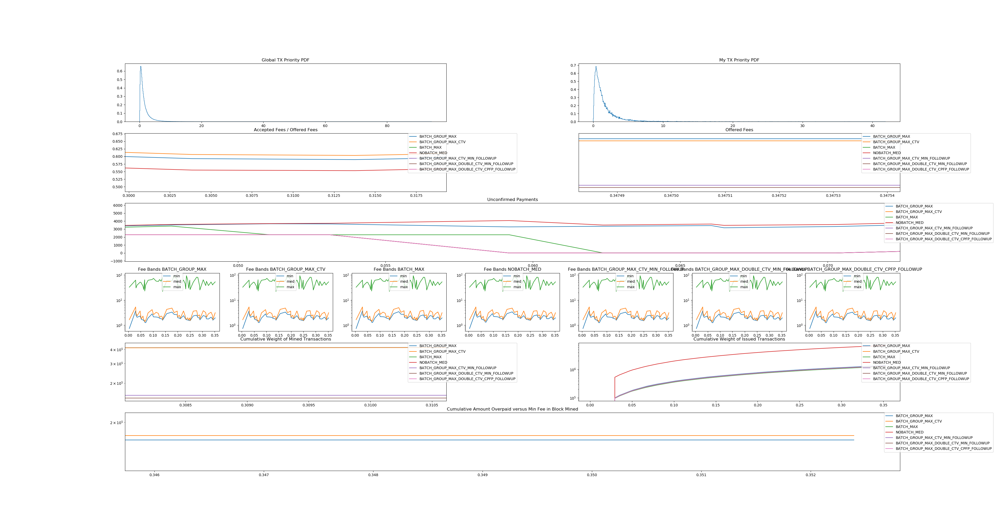

Check Template Verify is a new opcode for Bitcoin which allows transaction
issuers to split up their transaction into send and receive components. See
https://utxos.org for more information. This is potentially a big benefit
because end users can realize faster confirmations on pending transactions.

There is a concern that CTV would result in higher overall chain utilization
(because of overhead) than existing batching solutions. Ignoring the benefits
that CTV can have for earlier confirmations, it would be bad to introduce a
change to Bitcoin that causes users to be wasteful of chain space.

This simulation proposes and analyzes a model where CTV is a good user of chainspace.

The point of this simulation is to show that CTV is not *worse* than status quo
with respect to scalability. I hacked this together in a couple of hours so feel
free to suggest tweaks (via PR or issue) to make it more realistic & there may
correct errors of course.

## Setup

I am modeling a situation where every block:

- a business sees a number of payment requests per second
- the rest of the world does another number of payments per second
- Each payment and payment request has a priority
- Priorities are drawn randomly from a distribution

Because priority is relative, just the shape of the distribution of priority
matters. The default distribution is lognormal, but others are included to check
that the result holds across other distributions.

The distribution of priority is the big hypothetical point -- what distributions
are the actual priorities of outbound payments from businesses? Are they
constant -- then this model is invalid. But if they fall on a distribution, then
carry on reading...

## Specific Assumptions

If more than one payment request comes in within a single block period, it may
make sense to issue them in the same transaction *if they are around the same
priority*.

If they come in at different priorities, it may make sense to split up
transactions into batches based on their priority. If I have a batch that
contains payment A and priority A.p, and B and B.p, then the entire batch should
be at priority max(A.p, B.p). If A.p and B.p are too far apart, then batching
them is inefficient as one has to overpay to achieve the same feerate for the 
transaction.

Thus, we assume:

1. Transactions come in different priorities
1. A batch must pay a rate appropriate for the highest priority payment in the
   batch

## Strategies

Consider 4 batching implementations:

### Strategy "NOBATCH_MED":
 In this strategy we just issue transactions per payment, no
 batching or anything else fancy. We pay the median fee of the
 last block.
### Strategy "BATCH_MAX":
 In this strategy we batch transactions all together and then
 we pay the min of the median or max feerate in batch
### Strategy "BATCH_GROUP_MAX":
 In this strategy we batch transactions of similar feerate
 together and then we pay the min of the median or max feerate
 in each batch
### Strategy "BATCH_GROUP_MAX_CTV":
 In this strategy we batch transactions of similar feerate
 together and then we pay the min of the median or max feerate
 in each batch
 But instead of making independent batches, we put them through
 one layer of a high fee paying CTV root.
### Strategy "BATCH_GROUP_MAX_CTV_MIN_FOLLOWUP":
 In this strategy we batch transactions of similar feerate
 together and then we pay the min of the min feerate over the
 last ten blocks or max feerate in each batch
 But instead of making independent batches, we put them through
 one layer of a high fee paying CTV root with n_bins outputs.

 We cut through bins with only one element

 Pay 10-block low (but mineable) fee for each bin

### Strategy "BATCH_GROUP_MAX_DOUBLE_CTV_MIN_FOLLOWUP":
 In this strategy we batch transactions of similar feerate
 together and then we pay the min of the min feerate over the
 last ten blocks or max feerate in each batch
 But instead of making independent batches, we put them through
 two layers of CTV: a high fee paying CTV root with one output,
 and then a low paying CTV root with n_bins outputs.

 We cut through bins with only one element
 Pay 10-block low (but mineable) fee for each bin and second
 root

### Strategy "BATCH_GROUP_MAX_DOUBLE_CTV_CPFP_FOLLOWUP":
 In this strategy we batch transactions of similar feerate
 together and then we pay 0 (leaving it up to CPFP)
 But instead of making independent batches, we put them through
 two layers of CTV: a high fee paying CTV root with one output,
 and then a 0 paying CTV root with n_bins outputs.

 We cut through bins with only one element

 This puts people into priority bins, but allows CPFP to commit
 to the fees later avoiding over-offering of fees.

 Pay 10-block low (but mineable) fee for each bin and second
 root

Note that the simulations are not doing anything smart for binning, just calling
numpy.histogram. There's probably an optimal solution.

The BATCH_GROUP_MAX_CTV fan-out is also the "obvious" one -- pay a CTV for each bin in the txn
root, and then each CTV expands to the entire bin, skipping the CTV is there's
only one bin. The other CTV strategies present a couple optimizations which can
further improve the efficiency.

# Claims
My claims are as follows:

A. If it is lower fee to use priority binned batching than single batching, then
users will use priority binned batching for economic fee reducing reasons.
B. If CTV priority binned batching is more blockspace efficient that priority
binned batching, and hypothesis A. holds, this will overall make the chain usage
lower.
C. If CTV Priority Binned batching is more fee efficient than binned batching or
normal binned batching, it will be preferred.
D. If B., then C..
E. If A. and B., then CheckTemplateVerify does not decrease the availability of
chain space, even marginally so.

# Results

I recommend you run main.py yourself to see for yourself (and zoom around), as
well as play around with different parameters. The code is reasonably
documented.

And zoomed in on the interesting bits:

This confirms all of the claims presented previously, and shows that CTV can be 
a better user of chain space than existing methods.

This is an important point! We've demonstrated that CTV is better in terms of
chain space but we haven't discussed the "first order" benefits of CTV for
decongesting the mempool. See https://utxos.org/analysis/bip_simulation/.
This means not only will CTV help us confirm more payments more quickly, but
we'll also use less space. A pure win-win.

# Limitations

A better simulation would allow re-bundling the offered-but-not-taken fees into
a new RBF batch, which would benefit Priority Batching but not CTV batching.

The BATCH_GROUP_MAX_DOUBLE_CTV_CPFP_FOLLOWUP strategy also does not actually
use CPFP, a better simulation would measure how much fee savings can be realized
with CPFP.

If the assumptions around priority distributions do not hold, then CTV still has
benefits worth pursuing, but we should more carefully think about the space
usage impact on Bitcoin. With the strategies for batching presented, the overall
chain usage is a constant amount more, so the impact is at least non-asymptotic.
However, if CTV is still used in a tree structure to minimize individual
redeemer overhead, then what is the overhead? Assuming a radix of r, we need N/r
base layer transactions. And then N/r^2 above that, etc. For r >= 1, 1/r^0 +
1/r^1...1/r^inf = 1/(1-1/r).  So CTV would use about 10% more *transactions* for
a radix of 10, 5% more for a radix of 20, 1% for a radix of 100. The
transactions roughly corresponds to the amount of space used as well. Overall,
this means that businesses can balance out the worth of per-user decongesting
effects (which are optimal around radix 4) with fee savings on a dynamic basis,
and able to dial down the overhead to very little.
